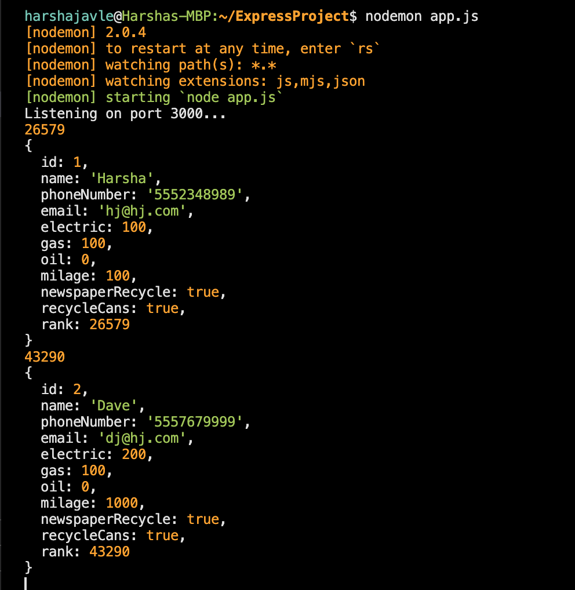
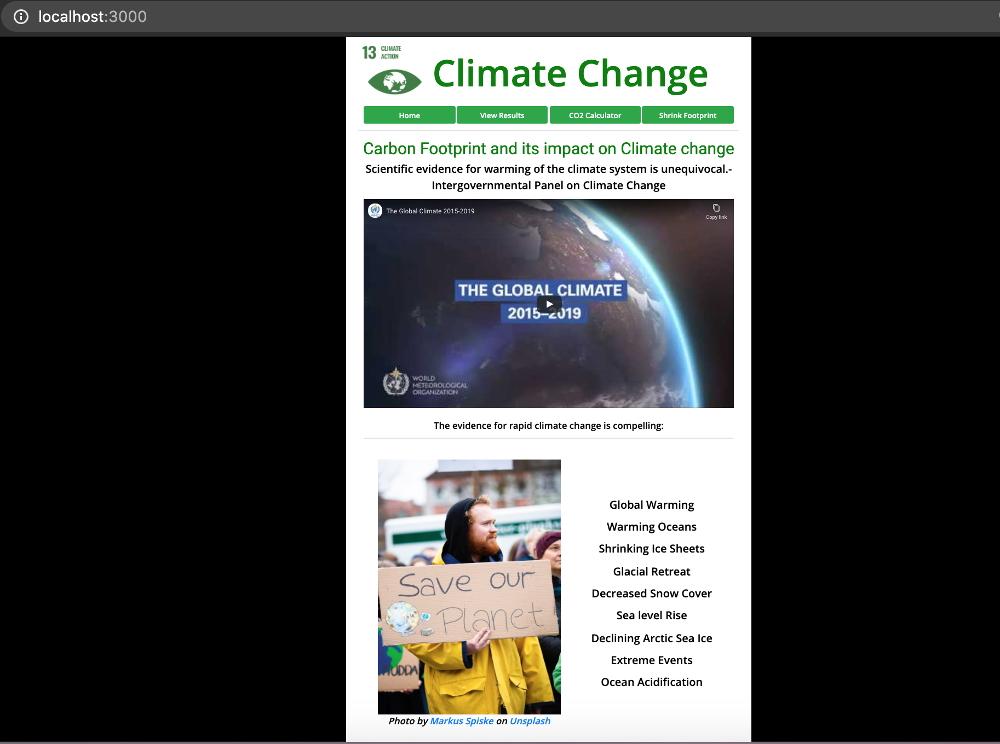
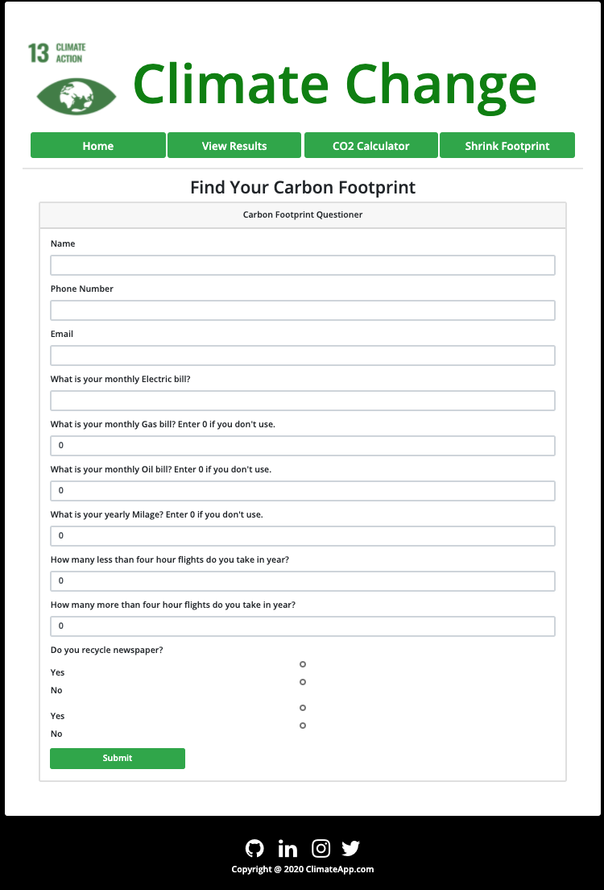
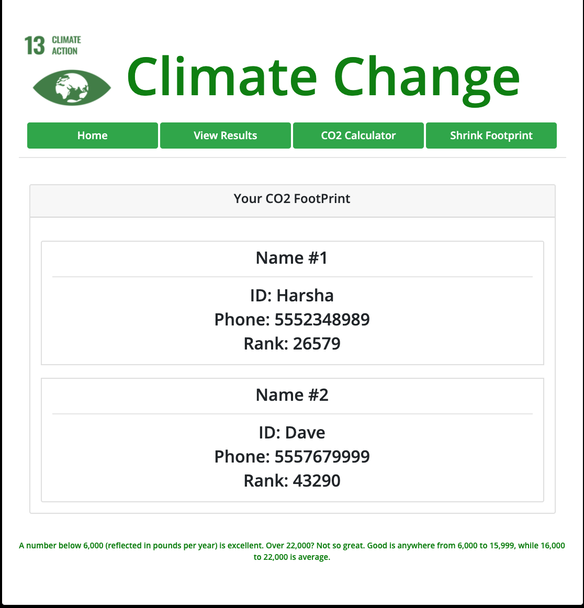

<h1 align="center">ClimateChange</h1>
<h2 align="center">

     

<h2 align="center"> Description </h2>

 As a individual or an organization we understand the importance of saving the planet for the future generations. How Changing Climate has impact on earth and its atmosphere. We wanted to generate a webpage that displays how individual's Carbon Footprint is affecting Global Climate Change and what can be done to reduce the Carbon Footprint. This app also brings awareness Global Climate Change UN's Goal # 13

---
## Table of contents
* [About](#about)
* [How to Use](#how-to-Use)
* [Licenses](#Licenses)
* [Questions](#Questions)
* [App Functionality](#App-Fuctionality)
* [Application](#application)
* [Credits](#credits)

---
### About
###### This App shows the information about global climate change. How to calculate individual's basic carbon footprint. Also displays how to shrink the carbon footprint.
---
### How to Use
###### 1.This web app starts and listens on port 3000. 
* App responds with `index.html`  for request to the (/) in browser. 

* App serves 4 static pages  as below: 
* `index.html` presents information about what is climate change and how Carbon Foot Print is contributing factor to crises of Global Climate Change.
* `calculate.html` presents information to calculate individual Carbon Foot Print which is a contributing factor for  climate change.

* `results.html` presents the results from user's Carbon Foot Print calculations and shows the results.

*  `shrinkfp.html` presents with recommendations with how to reduce the Carbon Foot Print.
---
### Technical Design
###### 1.This web app starts and listens on port 3000. 
###### 2.App uses Express server to create the API's to serve the html pages
###### 3.APIs use in memory array to store the data
---
### Licenses
###### None
---
### Any Questions?
###### Please email.
---
### Climate App 
[Project Repo](https://github.com/hjavle/ExpressProject)

---
### Application (coming soon)
[Climate App URL]()

### Credits
###### [Calculation referance from Forbes ](https://www.forbes.com/2008/04/15/green-carbon-living-forbeslife-cx_ls_0415carbon.html#5bd9e5131852)
###### [Nasa Reference ](https://climate.nasa.gov/evidence/)
###### [Shrink footprint Reference ](http://shrinkthatfootprint.com/)
###### [UN goal 13 Reference](https://www.un.org/sustainabledevelopment/climate-change/)
###### [Images credits Markus Spiske](http://www.uplash.com)

------

### App

------
<h1 align="center"> TechBridge Mission Statement </h1>

TechBridge breaks the cycle of generational poverty through the innovative use of technology to transform nonprofit and community impact.

## ❤ **_Hacking with Purpose_** ❤

